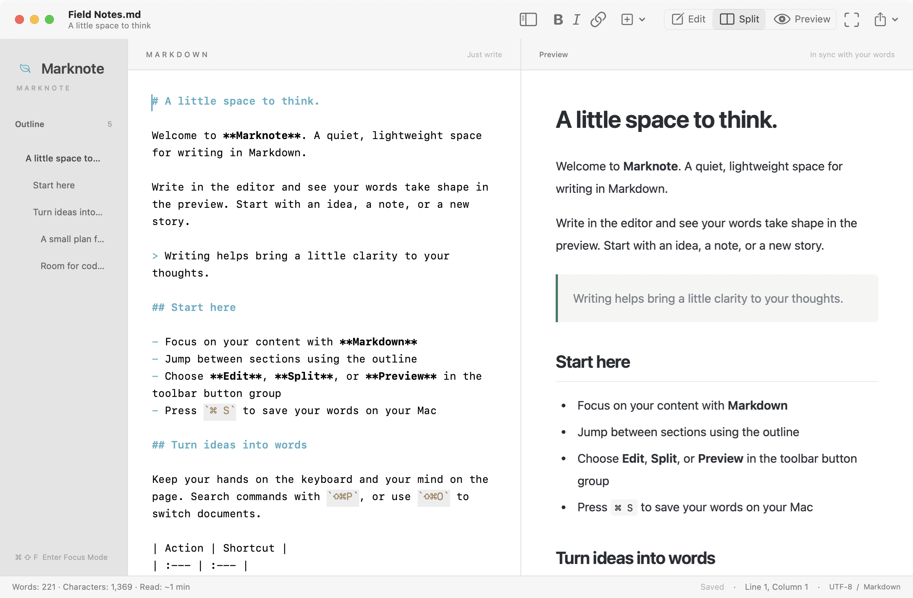
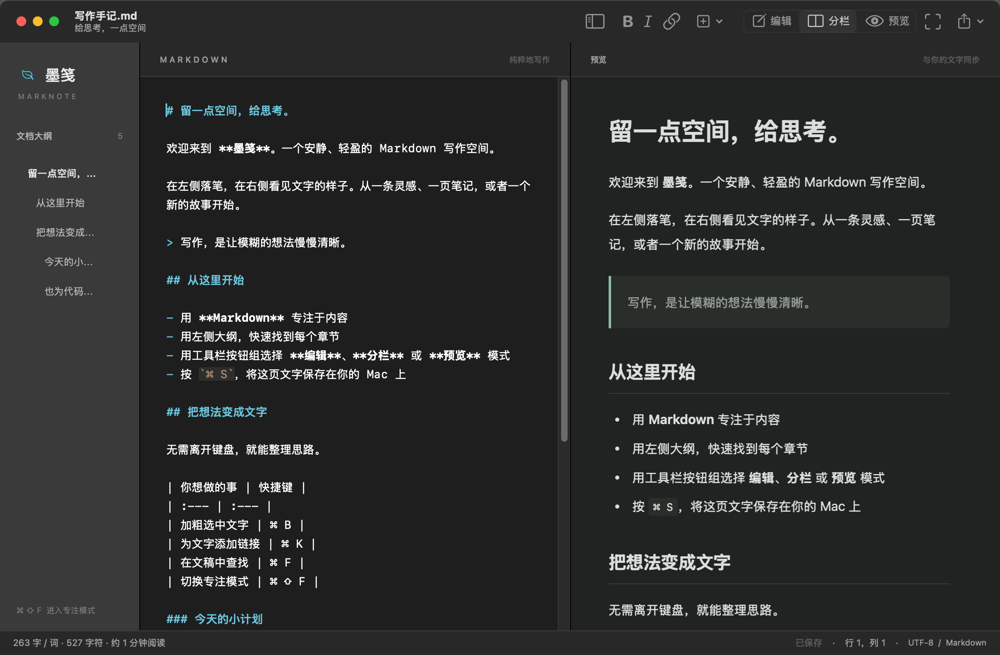
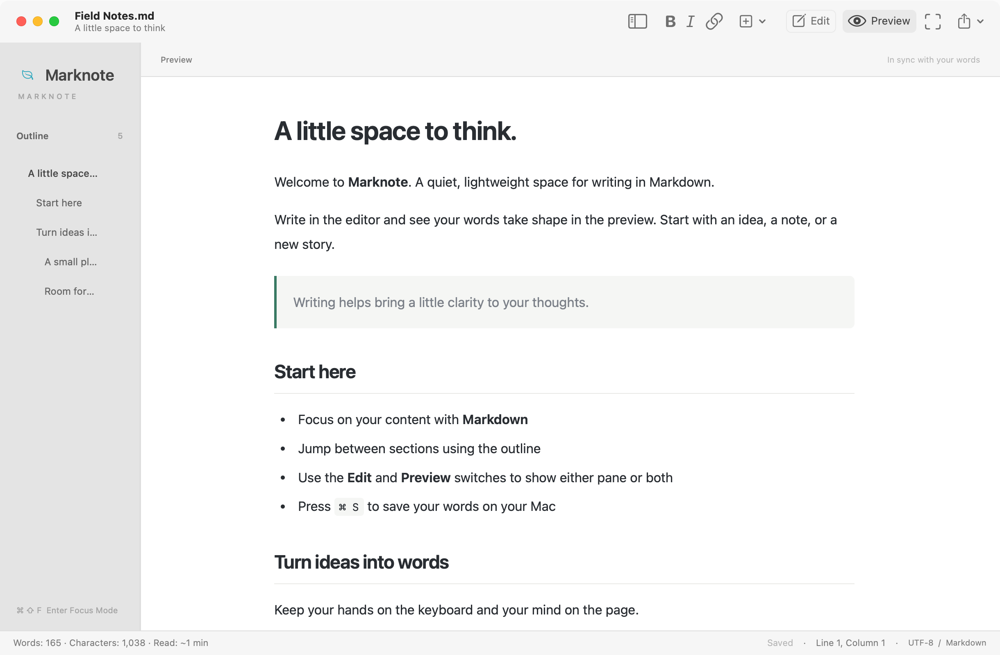
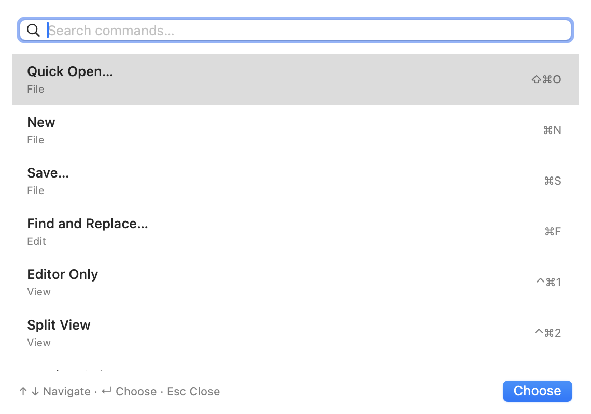

# Marknote · 墨笺

**A little space to think.** A lightweight, native Markdown editor for macOS.

[](https://github.com/laixintao/marknote/actions/workflows/ci.yml)

[Documentation](docs/en/README.md) · [Download](https://github.com/laixintao/marknote/releases/latest) · [Release guide](docs/en/releasing.md) · [简体中文](README.zh-CN.md)



Built with Swift, AppKit, and WebKit. Your files stay on your Mac. No account, Electron, or online service required to write.

## A space for everyday writing

- **Native editing** with syntax highlighting, find and replace, undo / redo, Chinese input, and adjustable type size.
- **Keyboard-first navigation** with a searchable command palette and quick open for open, recent, and nearby Markdown files.
- **Fewer editing steps** with image paste / drop, relative image assets, URL paste over selected text, and table formatting with Tab navigation.
- **Comfortable long-form writing** with optional paragraph focus and typewriter scrolling.
- **Your choice of layout** with an Edit / Split / Preview button group and focus mode.
- **A clear document structure** with a clickable outline, word and character counts, and cursor position.
- **Everyday Markdown** including code blocks, quotes, images, tables, task lists, and strikethrough.
- **Files you own** with UTF-8 documents, multiple windows, autosave, HTML export, and PDF export.
- **English and 简体中文** with instant language switching, saved preferences, and system light / dark appearance.

| Dark appearance | Preview only |
| --- | --- |
|  |  |

These are real AppKit window captures. Run `make screenshots` to regenerate them.



The writing tools are included in [version 1.2.0](CHANGELOG.md). The [five-product research report](docs/research/markdown-tools-2026.md) explains the user feedback and feature choices.

## Install and run

Requires **macOS 13+**. Install through [Homebrew](https://brew.sh) using the [personal tap](https://github.com/laixintao/homebrew-tap):

```sh
brew install --cask laixintao/tap/marknote
```

Homebrew selects the Apple Silicon or Intel build for your Mac. To update, run `brew update` followed by `brew upgrade --cask laixintao/tap/marknote`.

For a manual installation, on the [**Releases** page](https://github.com/laixintao/marknote/releases), download the `.dmg` installer: choose `macos-arm64` for Apple Silicon or `macos-x86_64` for Intel. Open it, drag `墨笺.app` to Applications, eject the disk image, and launch the installed app. ZIP archives are also available. Default CI builds are ad-hoc signed and are not Apple-notarized; see the [installation guide](docs/en/README.md) for first-launch details and building locally.

To build from source, install Swift 6.1+ through Xcode or Xcode Command Line Tools, plus Python 3.9+, then run:

```sh
make run
```

The app is built at `dist/墨笺.app`. The Markdown parser and translations are bundled; no Swift dependency downloads are needed.

## At your fingertips

| Action | Menu / shortcut |
| --- | --- |
| Open `.md` files by default | Marknote → Set as Default Markdown Editor… |
| Change language | Marknote → Language / 语言 |
| Search commands / Quick open | `⇧⌘P` / `⇧⌘O` |
| Insert image / Format table | `⇧⌘I` / `⌥⌘T` |
| Paragraph focus / Typewriter scrolling | View menu |
| Choose Edit / Split / Preview | Toolbar button group, or `⌃⌘1` / `⌃⌘2` / `⌃⌘3` |
| Focus mode | `⌘⇧F` |
| Save / Find | `⌘S` / `⌘F` |
| Bold / Italic / Link | `⌘B` / `⌘I` / `⌘K` |
| Export PDF | `⌘⇧E` |

Switching language or layout preserves your document, selection, and undo history. Outline navigation keeps the current mode and jumps within the visible panes. See the [user guide](docs/en/README.md) for all shortcuts and document behavior.

## Develop, verify, release

```sh
make help         # List commands
make verify       # Repository checks, release-tool tests, core and native UI tests
make installer    # Build and verify a drag-to-install DMG
make package      # Versioned DMG + ZIP + SHA-256 for this Mac
make release      # Push a version tag; wait for GitHub CI to publish release assets
```

[CI](.github/workflows/ci.yml) checks Apple Silicon and Intel builds on branch pushes and pull requests, and retains packages, reports, and screenshots. The [Release workflow](.github/workflows/release.yml) publishes DMG installers, ZIP archives for both architectures, and `SHA256SUMS.txt` only after both platforms pass. Interrupted uploads leave an unpublished draft for recovery.

Before your first release, commit and push the project to GitHub, configure `origin`, enable Actions, and log in with `gh`. See the [release guide](docs/en/releasing.md) / [中文发布指南](docs/zh-CN/releasing.md) for version updates, retries, and optional Developer ID signing and notarization.

## Documentation

- [English user guide](docs/en/README.md) / [中文使用文档](docs/zh-CN/README.md)
- [English release guide](docs/en/releasing.md) / [中文发布指南](docs/zh-CN/releasing.md)
- [Markdown tools: research and feature choices](docs/research/markdown-tools-2026.md) / [中文调研摘要](docs/zh-CN/market-research.md)
- [Changelog](CHANGELOG.md) · [Contributing](CONTRIBUTING.md) · [Local validation](VALIDATION.md)

Markdown is parsed by bundled [Marked 15.0.12](https://github.com/markedjs/marked/tree/v15.0.12), distributed with its [MIT license](Sources/MarknoteCore/Resources/marked-LICENSE.md). Raw HTML is displayed as text; document scripts never run. Remote images load over the network, and local image access is limited to the document directory. Math, Mermaid, and plugins are not currently supported.
