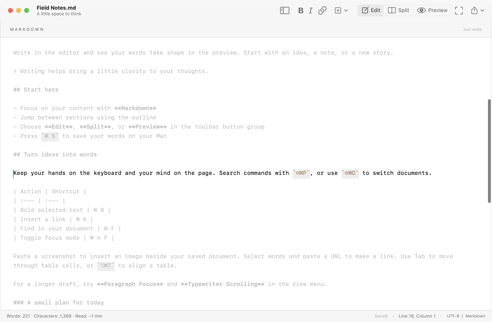

# Marknote user guide

[Project home](../../README.md) · [简体中文](../zh-CN/README.md) · [Release guide](releasing.md) · [Feature research](../research/markdown-tools-2026.md)


## Install

Requires macOS 13 or later. On the [Releases page](https://github.com/laixintao/marknote/releases), choose the package matching the processor shown in About This Mac:

| Mac | File |
| --- | --- |
| Apple Silicon (M series) | `Marknote-<version>-macos-arm64.dmg` |
| Intel | `Marknote-<version>-macos-x86_64.dmg` |

Open the DMG and drag `墨笺.app` onto the Applications shortcut. Eject the disk image, then open the installed app from Applications. For an update, quit the old version before replacing it; your Markdown files and preferences remain separate. ZIP archives are available as an alternative.

Download `SHA256SUMS.txt` and compare its matching entry with `shasum -a 256 installer.dmg`. If all four DMG / ZIP files have been downloaded, `shasum -a 256 -c SHA256SUMS.txt` verifies all of them.

Default GitHub builds are ad-hoc signed and are not Apple-notarized. macOS may block the first launch; follow the system prompt and [Apple's app security guidance](https://support.apple.com/102445), or build locally on your Mac. Optional Developer ID signing and notarization are covered in the [release guide](releasing.md).

## Build from source

Install Swift 6.1+ through Xcode or Command Line Tools, Python 3.9+, and use the Make included with macOS:

```sh
make run
```

The app is generated at `dist/墨笺.app`. For a debug build, use `make build CONFIGURATION=debug`. You can open `Package.swift` in Xcode; use the packaged `.app` for document associations and application menus. Resources are bundled and no Swift dependency downloads are required.

## Open Markdown files by default

After installing, choose **Marknote → Set as Default Markdown Editor…** and approve any macOS prompt. Double-clicking `.md`, `.markdown`, `.mdown`, and `.mkd` files will then open them in Marknote. General text files such as `.txt` keep their current default app. The setting is applied only when you choose this command; running from the read-only installer prompts you to install first.

You can also use Finder: select a `.md` file → **Get Info** (`⌘I`) → **Open with** → choose **Marknote** → **Change All…**. This is also how you switch back to a different editor. A file with its own custom Open With setting may need to be changed individually.

## Write and save

The first launch opens an editable guide. Open it again from Help → Marknote User Guide. Use `⌘N` for a new document and `⌘O` to open a file.

Supported files include UTF-8 `.md`, `.markdown`, `.mdown`, `.mkd`, and plain text. UTF-8 byte-order marks are removed when reading. New documents need a location on their first save. Existing documents use NSDocument autosave in place; you can also press `⌘S`. Closing a document with unsaved changes prompts you to save, and Cancel returns to editing.

Documents have separate windows and support system tabs. Switching language or layout preserves the editor, text, selection, and undo history.

## Edit, preview, and focus

The toolbar has a single-choice **Edit / Split / Preview** button group. Edit shows only the editor, Split shows both panes, and Preview shows only the rendered document. Selecting the current mode again keeps it active.

The View menu and toolbar stay in sync. Each window has its own layout, retained for that window's lifetime. Focus mode hides the outline and preview; leaving it restores the previous layout. Choosing Split or Preview while focused exits focus mode and opens the selected layout.

The outline lists document headings. Clicking a heading keeps the current mode: Edit jumps in the editor, Preview scrolls the rendered document, and Split locates the heading in both panes. Headings inside fenced code blocks are excluded. Adjust the editor font size from View; your font size preference is saved.

## Find commands and documents

Open **View → Command Palette** (`⇧⌘P`) and type a command name. Search accepts English and Chinese keywords, ignores case, and supports abbreviated matches. Recently used commands appear first when the query is empty. Use ↑ / ↓ and Return to choose, or Escape to cancel.

**File → Quick Open** (`⇧⌘O`) searches filenames and paths among open documents, recent files, and up to 1,000 Markdown files directly beside the current saved document. It does not scan subfolders or search document contents. Opening a file preserves your current document in its window.


## Images, links, and tables

Paste an image into the editor, drag image files onto the text, or choose **Format → Insert Image…** (`⇧⌘I`). Marknote copies each image into `assets/` beside the document and inserts a relative Markdown link. An untitled document prompts you to save first; cancelling leaves it unchanged. Move the document and its `assets/` folder together to keep the images available.

PNG, JPEG, GIF, and WebP files are supported, up to 20 MB and 40 million pixels each. Clipboard TIFF images are converted to PNG. Files use unique names to avoid overwriting existing assets. Undo removes the inserted Markdown but keeps the file so Redo works; unused assets can be removed manually when they are no longer needed.

Select words and paste an `http://`, `https://`, or `mailto:` URL to turn those words into a link. **Edit → Paste as Plain Text** (`⌥⇧⌘V`) inserts the clipboard text directly instead.

In a Markdown table, **Format → Format Table** (`⌥⌘T`) aligns the source columns while retaining left / centre / right alignment markers and escaped pipes. Tab selects the next cell, Shift-Tab the previous cell, and Tab in the final cell adds a row. These helpers work with ordinary pipe tables with at least two columns and a separator row; code blocks are left alone.

## Focus on your writing

**View → Paragraph Focus** dims paragraphs outside the current selection. **View → Typewriter Scrolling** keeps the current line near the vertical centre of the editor. These options work independently of the existing focus layout and can be combined. They are remembered for newly opened windows; existing windows retain their own settings.

Selecting text with the mouse pauses automatic centring. Chinese input composition remains intact. These display options do not change the document text or its saved state.



The tools in these three sections are available in the source build on `main`; see [Unreleased](../../CHANGELOG.md) for changes awaiting a tagged release.

## Language and appearance

Choose **Marknote → Language / 语言 → System Default, 简体中文, or English**. The default follows supported languages in your system preference list, falling back to English when none are supported.

Your choice is saved, and all open windows update their app menus, toolbar labels, hints, and status text immediately. Apple-provided panels and system text adopt the new language after restarting the app. Existing document content, including an open guide, is never translated; open a new guide from Help to use the current language.

Light and dark appearance follow macOS settings.


## Shortcuts

| Action | Shortcut |
| --- | --- |
| New / Open / Save | `⌘N` / `⌘O` / `⌘S` |
| Save As | `⌘⇧S` |
| Undo / Redo | `⌘Z` / `⌘⇧Z` |
| Bold / Italic / Link | `⌘B` / `⌘I` / `⌘K` |
| Find and replace | `⌘F` |
| Command palette / Quick open | `⇧⌘P` / `⇧⌘O` |
| Insert image / Format table | `⇧⌘I` / `⌥⌘T` |
| Next / Previous table cell | `Tab` / `⇧Tab` |
| Paste as plain text | `⌥⇧⌘V` |
| Toggle outline | `⌘⌥0` |
| Toggle Edit / Preview | `⌘⌥E` / `⌘⌥P` |
| Editor only / Split / Preview only | `⌃⌘1` / `⌃⌘2` / `⌃⌘3` |
| Focus mode | `⌘⇧F` |
| Heading 1 | `⌘⌥1` |
| Bulleted list / Task list | `⌘⇧L` / `⌘⇧T` |
| Export PDF | `⌘⇧E` |

Return continues lists, tasks, and quotes. Return on an empty list item exits the list. The Insert menu also provides tables, code blocks, and quotes.

## Export, privacy, and limits

The File menu exports standalone HTML and PDF. PDF uses a continuous long-page layout. HTML exports embed accessible local images.

The app needs no account and does not upload documents. Writing and parsing work offline. HTTP(S) images in documents send requests to their image servers; external links open in your default browser.

Raw HTML is displayed as text, and document scripts never execute. Relative image paths can access PNG, JPEG, GIF, and WebP files only inside the document directory and its descendants, up to 20 MB per image. Save a document before using relative images. Math, Mermaid, cloud sync, plugins, and in-app automatic updates are not included.

## Troubleshooting

- Cannot open a file: check that it contains UTF-8 text.
- Local image is missing: save the document and check its relative path, format, and size.
- System panels use the old language: save your work, quit, and reopen the app.
- No release download exists: the maintainer needs to complete the [first release](releasing.md).

For a bug report, include macOS version, chip type, app version, reproduction steps, and a minimal sample with private content removed. See [Contributing](../../CONTRIBUTING.md) to work on the app.
