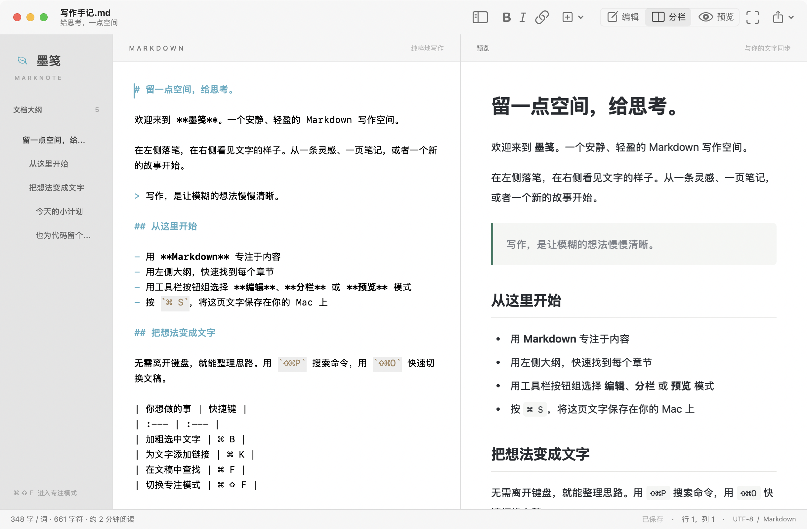

# 墨笺使用文档

[项目首页](../../README.zh-CN.md) · [English](../en/README.md) · [发布指南](releasing.md) · [功能调研](market-research.md)



## 安装

墨笺支持 macOS 13 及以上。打开 [Releases 页面](https://github.com/laixintao/marknote/releases)，按“关于本机”中的处理器类型选择安装包：

| Mac 类型 | 文件名 |
| --- | --- |
| Apple Silicon（M 系列） | `Marknote-<版本>-macos-arm64.dmg` |
| Intel | `Marknote-<版本>-macos-x86_64.dmg` |

打开 DMG，将 `墨笺.app` 拖到 Applications（应用程序）快捷方式，推出安装磁盘，然后从“应用程序”打开。更新时先退出旧版本再替换应用，文稿和偏好设置会保留。也提供 ZIP 压缩包。

可下载 `SHA256SUMS.txt`，用 `shasum -a 256 安装包.dmg` 与对应一行比较；若全部四个 DMG / ZIP 文件均已下载，可执行 `shasum -a 256 -c SHA256SUMS.txt`。

默认 GitHub 构建使用临时签名，未经 Apple 公证，macOS 可能阻止首次打开。请根据系统提示及 [Apple 的应用安全说明](https://support.apple.com/102445)处理；也可从源码在自己的 Mac 上构建。Developer ID 签名与公证流程见[发布指南](releasing.md)。

## 从源码运行

准备 Swift 6.1+（Xcode 或 Command Line Tools）、Python 3.9+ 和 macOS 自带的 Make：

```sh
make run
```

输出为 `dist/墨笺.app`；`make build CONFIGURATION=debug` 可生成调试版。Xcode 可以直接打开 `Package.swift`，完整文件关联与应用菜单请使用 `.app`。构建过程使用本地内置资源，不下载 Swift 依赖。

## 默认打开 Markdown 文件

安装后选择 **墨笺 → 设为默认 Markdown 编辑器…**，并确认 macOS 可能显示的提示。以后双击 `.md`、`.markdown`、`.mdown`、`.mkd` 文件即可用墨笺打开，`.txt` 等普通文本的默认应用保持原有设置。此设置只在点击该命令时更改；从只读安装磁盘运行时，会提示先完成安装。

也可通过 Finder 设置：选中一个 `.md` 文件 → **显示简介**（`⌘I`）→ **打开方式** → 选择 **墨笺** → **全部更改…**。以后想换回其他编辑器，按同样步骤重新选择即可。单独指定过打开方式的文件可能需要分别更改。

## 写作与保存

首次打开会显示可编辑的使用指南；“帮助 → 墨笺使用指南”可以再次打开。新建文稿用 `⌘N`，打开文件用 `⌘O`。

支持 UTF-8 `.md`、`.markdown`、`.mdown`、`.mkd` 和普通文本。读取 UTF-8 BOM 时会移除 BOM。新文稿首次保存需要选择路径；已有文件使用 NSDocument 原位自动保存，也可随时按 `⌘S`。关闭有未保存更改的文稿时，系统会提示保存；取消后继续编辑。

每份文稿拥有独立窗口，也支持系统标签页。语言与布局切换不会重建编辑器，不会替换正文或清空选区、撤销记录。

## 编辑、预览与专注

工具栏使用 **编辑 / 分栏 / 预览** 单选按钮组：编辑只显示编辑器，分栏同时显示两边，预览只显示渲染后的文稿。再次点击当前模式会保持该模式。

显示菜单与工具栏状态同步。各窗口的布局独立，当前布局仅在该窗口生命周期内保留。开启专注模式会隐藏大纲和预览；退出时恢复此前布局。在专注模式中选择分栏或预览，会退出专注并使用选中的布局。

点击大纲标题会保留当前显示模式：编辑模式定位编辑器，预览模式滚动预览，分栏模式同时定位两边。代码围栏内的标题不会进入大纲。字号可从“显示”菜单调整，选择会保存。

## 搜索命令与快速打开

用 **显示 → 命令面板**（`⇧⌘P`）搜索命令，支持中英文关键词、忽略大小写和缩写匹配。搜索框为空时，最近使用的命令排在前面。↑ / ↓ 选择，回车执行，Escape 取消。

**文件 → 快速打开**（`⇧⌘O`）按文件名和路径搜索已打开、最近使用，以及当前文稿同目录的最多 1,000 个 Markdown 文件。不会扫描子目录或检索正文。打开新文件后，原文稿保留在自己的窗口中。

## 图片、链接和表格

在编辑器粘贴图片、将图片文件拖到正文，或选择 **格式 → 插入图片…**（`⇧⌘I`）。墨笺将图片复制到文稿旁的 `assets/` 文件夹，并插入相对路径。未保存的文稿会先提示保存，取消则保持正文不变。移动文稿时，请一并移动 `assets/`。

支持 PNG、JPEG、GIF 和 WebP，每张最大 20 MB、4,000 万像素；剪贴板中的 TIFF 会转为 PNG。图片采用独立文件名，不覆盖已有附件。撤销会移除正文中的图片引用并保留文件，以便重做；确定不再需要的附件可手动删除。

选中文字后粘贴 `http://`、`https://` 或 `mailto:` 网址，即可用这些文字生成链接。**编辑 → 粘贴为纯文本**（`⌥⇧⌘V`）可以直接插入剪贴板文字。

将光标放在 Markdown 表格内，使用 **格式 → 整理表格**（`⌥⌘T`）对齐源码列，保留左、中、右对齐标记和转义竖线。Tab 选中下一格，Shift-Tab 返回上一格，在最后一格按 Tab 会新增一行。适用于至少两列、包含分隔行的普通竖线表格；代码块中的内容不会被处理。

## 专注长文写作

**显示 → 段落聚焦** 会淡化当前选区以外的段落；**显示 → 打字机滚动** 将当前行保持在编辑器中央附近。这两项与既有专注布局分别开关，也可同时使用。偏好会用于新打开的窗口，已经打开的窗口保留各自设置。

鼠标选择文字时暂停自动居中，中文输入法组合文本不受影响。这些显示选项不会修改正文或保存状态。


以上三节的新工具在 [1.2.0 版本](../../CHANGELOG.md)中加入。

## 语言和外观

在 **墨笺 / Marknote → 语言 / Language** 选择“跟随系统”“简体中文”或“English”。默认跟随系统语言；系统首选语言中没有受支持的语言时使用英语。

选择自动保存，所有窗口的应用菜单、工具栏、提示和状态文案立即更新。macOS 自带的系统面板与原生系统文案在重启应用后采用新语言。已打开的正文（包括使用指南）不会自动翻译；重新从帮助菜单打开指南会采用当前语言。

浅色与深色外观跟随 macOS 设置。


## 快捷键

| 操作 | 快捷键 |
| --- | --- |
| 新建 / 打开 / 保存 | `⌘N` / `⌘O` / `⌘S` |
| 另存为 | `⌘⇧S` |
| 撤销 / 重做 | `⌘Z` / `⌘⇧Z` |
| 加粗 / 斜体 / 链接 | `⌘B` / `⌘I` / `⌘K` |
| 查找与替换 | `⌘F` |
| 命令面板 / 快速打开 | `⇧⌘P` / `⇧⌘O` |
| 插入图片 / 整理表格 | `⇧⌘I` / `⌥⌘T` |
| 下一格 / 上一格 | `Tab` / `⇧Tab` |
| 粘贴为纯文本 | `⌥⇧⌘V` |
| 开关文档大纲 | `⌘⌥0` |
| 开关编辑 / 预览区域 | `⌘⌥E` / `⌘⌥P` |
| 只编辑 / 双栏 / 只预览 | `⌃⌘1` / `⌃⌘2` / `⌃⌘3` |
| 专注模式 | `⌘⇧F` |
| 一级标题 | `⌘⌥1` |
| 无序列表 / 待办事项 | `⌘⇧L` / `⌘⇧T` |
| 导出 PDF | `⌘⇧E` |

列表、待办和引用可以回车续写，空列表再次回车会退出。插入菜单还提供表格、代码块和引用。

## 导出、隐私与边界

“文件”菜单可导出独立 HTML 与 PDF。PDF 为连续长页排版；导出 HTML 会嵌入可访问的本地图片。

应用不需要账号，也不上传文稿。普通写作和解析可离线完成；文稿中的 HTTP(S) 图片会向图片服务器发送网络请求，点击外部链接会打开默认浏览器。

原始 HTML 显示为文字，预览不会执行文稿脚本。本地相对图片路径只能访问文稿所在目录及其子目录中的 PNG、JPEG、GIF、WebP，单张最大 20 MB；未保存文稿还没有用于解析相对图片的目录。暂不提供数学公式、Mermaid、云同步、插件或应用内自动更新。

## 遇到问题

- 不能打开文稿：确认文件是 UTF-8 文本。
- 本地图片不显示：先保存文稿，检查相对路径、图片类型及大小。
- 系统面板仍是旧语言：保存文稿后退出并重新打开应用。
- 查不到安装包：仓库维护者需要先完成[首次发布](releasing.md)。

反馈问题时请附 macOS 版本、芯片类型、应用版本、复现步骤，以及已移除敏感内容的最小示例。参与开发见[贡献指南](../../CONTRIBUTING.md)。
